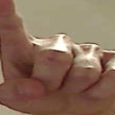
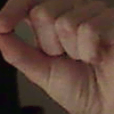
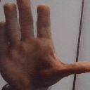
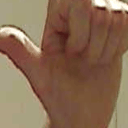
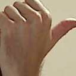

# 1. CS5100 Final Project: Computer Remote Control via Dynamic Hand Gestures
**Authors** <br>
Jacob Krucinski - [email](mailto:krucinski.j@northeastern.edu) <br>
Hau Ha - [email](mailto:ha.hau@northeastern.edu) <br>
Maalolan Bharaniraj - [email](mailto:krucinski.j@northeastern.edu) <br>
Yiting Wu - [email](mailto:wu.yitin@northeastern.eduu) <br>
Andrew Panzone- [email](mailto:panzone.an@northeastern.edu) <br>

## 1.1. Project Overview
In this project, we aim to explore the intersection of computer vision and machine learning 
for human gesture recognition, specifically focusing on dynamic hand gestures. 
The recognized hand gestures will enable various computer interactions, such as scrolling, navigating between applications, or zooming in/out on a website or document.
These gestures are based on interactions when using a touch-screen device (e.g. pinch in/out
to zoom out/in).

The 6 gestures are mapped to indices as follows:
| Gesture ID | Gesture Name   |
|------------|----------------|
|      0     |    ScrollUp    |
|      1     |   ScrollDown   |
|      2     |     ZoomIn     |
|      3     |     ZoomOut    |
|      4     |  AppSwitchLeft |
|      5     | AppSwitchRight |

Below are sample GIFs which visualize these 6 gestures (indices 0 to 5
as defined above): <br>







This project is split into two parts: dynamic hand gesture classification and compute control.
For the dynamic hand gesture classification, we develop both an LSTM and hybrid model (see ML 
workflow below). As for computer control, we use the
[pyautogui](https://pyautogui.readthedocs.io/en/latest/) library to mimic
keyboard shortcuts for the desired gesture (e.g. Ctrl and + for zoom in).

Our ML workflow is defined as follows:
1. Data collection: We use Google's MediaPipe library to perform 
   [hand landmark detection](https://ai.google.dev/edge/mediapipe/solutions/vision/hand_landmarker) to save both the hand bounding boxes and 21 key point x/y/z coordinates from model training and validation
2. Model Training: Upon reviewing the literature for similar tasks (see section 1.5), we chose to create the following 
   model architectures for dynamic hand gesture classification
   1. LSTM only for ZoomIn/ZoomOut gestures
   2. LSTM only for all 6 gestures
   3. Inception v3 + LSTM for only ZoomIn/ZoomOut gestures
   4. Inception v3 + LSTM for all gestures
3. Model Validation: We analyze our LSTM classification models uing metrics on the validation
   set. This includes showing the confusion matrix and ROC curve.

## 1.2. Environment Setup
To set up a Python environment to use this repo, we suggest creating a new 
Anaconda Python 3.10 environment by running the following command in a terminal:
```
conda create -n venv python=3.10
```

To install all the library requirements, please run the following terminal command
from the root directory of the repository:
```
pip install -r requirements.txt
```

The environment size is ~2GB including TensorFlow.


## 1.3. Data Collection Procedure
### 1.3.1. Script Instructions
To perform data collection, first switch to the `data_collection` subfolder from the 
root directory via:
```
cd data_collection
```

To run the main data collection, call the following Python command:
```
python data_collection_FULL.py
```

You will be prompted to enter an integer with how many gestures you would like to record.
Upon entering this, you will be presented with window with the live webcam feed,
overlayed with the FPS, current logging state and sequence number, and current gesture
being logged.

The logged data will be timestamped and stored in the `data/` subfolder as 3 separate files:
1. `X_data_{timestamp}.npy`: A NumPy binary file that has an array of size $n_{obs} \times 21 \times 3 \times 10$. $n_{obs}$ is the number of recorded gestures, 21 is for the 21 hand key points, 3 is
   for x/y/z coordinates, and 10 is for the number of frames per gesture.
2. `Y_data_{timestamp}.npy`: A NumPy binary file that has an array of size $n_{obs} \times 6$, where 
   6 is the number of gesture classes (see table in section 1.1). Each row is a one-hot encoding.
3. `img_data_{timestamp}.npy`: A NumPy binary file that has an array of size 
   $n_{obs} \times 128  \times 128 \times 3 \times 10$. It stores $128 \times 128$ RGB images for all 10 frames for all $n_{obs}$ gestures

**NOTE:** You may need to change the camera capture device index depending on whether
you are using an external webcam. `0` is the default, but it can be changed on line 235
of `data_collection_FULL.py`

### 1.3.2. Data Collection Protocol
To start recording a gesture, press the space key. To increase the gesture index being recorded,
press the `w` key. To decrease the gesture index being recorded, press the `s` key. Data is 
only collected when **ONE** hand is detected in the image. Please refer to the GIFs in section 1.1 
for hand gestures that need to be recorded.

Gestures are recorded for 10 frames spanning over 3 seconds (~0.3 seconds delay between frames).
This is to ensure hand gesture images do not come out blurry due to camera shutter speed. Therefore,
make sure to perform the gestures **slowly** over the full 3 second period. It's important to 
note that gesture collection automatically stops once the 3 seconds are over, when the hand key 
points are out-of-bounds, or two hands are detected. Please avoid these cases while performing
the data collection.

For a varied data collection, we suggest trying the following variants in your data collection:
* Use both left and right hands
* Various backgrounds (light, dark, skin-colored, bright color, etc.)
* Various hand positions in the frame (middle, top left, top right, bottom left, bottom right,
  close to camera, far away from camera, face in frame, face out of frame, etc.)
* Various gesture finger movements 
  * ZoomIn/ZoomOut: Use thumb and index finger, use thumb and middle finger, use thumb and both index/middle finger 
  * ScrollUp/ScrollDown: Scroll with 1, 2, or 3 fingers, or even whole hand
  * AppSwitchLeft/AppSwitchRight: Point and swipe index finger to the left or right

### 1.3.3. Upload Instructions
Once you finish the data collection, please create your own folder in this [OneDrive](https://northeastern-my.sharepoint.com/:f:/g/personal/krucinski_j_northeastern_edu/EqEDO4yamGVPhVWmE909nesBh8dT98CK5gHrYovOxtt3vA?e=dceDli) link and upload your `X_data_{}.npy`, `Y_data_{}.npy`, and `img_data_{}.npy` files to it. Thank you!


### 1.3.4. Privacy Statement
We want to notify users that webcam image frames are recording in the data collection script.
Only the sub-image/bounding box containing your hand is stored, and *not* the whole frame, 
therefore your face will not be saved unless it is directly behind your hand during the data
collection. If you do not feel comfortable with this facial data collection, you can omit 
the `img_data_{}.npy` file from your upload to OneDrive.

## 1.4. Repository Organization
### 1.4.1. `data_collection` folder 

This folder contains scripts developed for collecting and analyzing hand landmark data using computer vision libraries. The main components include:

- **data_collection_FULL.py**: A comprehensive script that builds upon `data_collection_key_pts.py`. It enables the detection and saving of full-hand subimages, with features to manage timing delays for optimized data collection. The script utilizes OpenCV and MediaPipe for real-time hand landmark detection through a webcam feed.

- **data_collection_key_pts.py**: A foundational script that focuses on capturing key hand landmarks using OpenCV and MediaPipe. It serves as the basis for more advanced data collection functionalities.

These scripts are integral for generating datasets needed for hand gesture recognition and related applications.

### 1.4.2. `mediapipe` test 


This folder contains scripts for testing and visualizing hand landmark detection using MediaPipe and OpenCV. These scripts provide a framework to analyze and improve hand gesture recognition, with features such as real-time visualization and performance tracking.

- **mediapipe_test_webcam_v4.py**: An advanced testing script that adds FPS display and a 3D scatter plot of hand coordinates for a comprehensive visualization of hand landmarks. The script is optimized for different resolutions, balancing frame rates and processing efficiency.

- **mediapipe_test_webcam.py**: A foundational script for hand landmark detection using a webcam feed, focusing on real-time hand tracking and annotation.

- **mediapipe_test_image.py**: A script for testing hand landmark detection on static images, useful for evaluating detection accuracy and performance on non-dynamic content.

These scripts collectively serve to experiment with and validate hand gesture recognition techniques using different inputs and visualization methods.

## 1.5. Literature Review / Resources
Dynamic hand gesture recognition has been extensively studied, leveraging various methodologies and datasets. The following key works informed the design and implementation of our project:

Deep Learning Hybrid Architectures
Yaseen et al. (2020) proposed a hybrid architecture that integrates Google’s MediaPipe for extracting hand regions of interest (ROI) with a pre-trained Inception-V3 model for spatial feature extraction. The spatial features were passed through an LSTM-Dense model to capture temporal patterns, resulting in significant accuracy improvements compared to traditional 3D CNN architectures. This work highlights the efficiency of combining spatial and temporal learning for dynamic gestures.

Pre-trained Convolutional Neural Networks (CNNs)
Szegedy et al. (2016) developed Inception-V3, a pre-trained convolutional neural network designed for image classification tasks. This model has been adapted for gesture recognition due to its robust deep feature extraction capabilities and compatibility with global pooling layers, making it suitable for analyzing complex hand gestures.

3D Convolutional Networks
Tran et al. (2015) introduced 3D convolutional neural networks (3D CNNs) to learn spatiotemporal features by stacking RGB image frames into a volumetric input. While effective for capturing both spatial and temporal information, 3D CNNs are computationally intensive, making them less suitable for real-time applications or hardware-limited environments.


## References
Yaseen, O.-J. Kwon, J. Kim, S. Jamil, J. Lee,
and F. Ullah, “Next-gen dynamic hand ges-
ture recognition: Mediapipe, inception-v3 and
lstm-based enhanced deep learning model,” Elec-
tronics, vol. 13, no. 16, 2024. [Online]. Available:
https://www.mdpi.com/2079-9292/13/16/3233

C. Szegedy, V. Vanhoucke, S. Ioffe, J. Shlens, and
Z. Wojna, “Rethinking the inception architecture
for computer vision,” 2015. [Online]. Available:
https://arxiv.org/abs/1512.00567

D. Tran, L. Bourdev, R. Fergus, L. Torresani,
and M. Paluri, “Learning spatiotemporal features
with 3d convolutional networks,” 2015. [Online].
Available: https://arxiv.org/abs/1412.0767